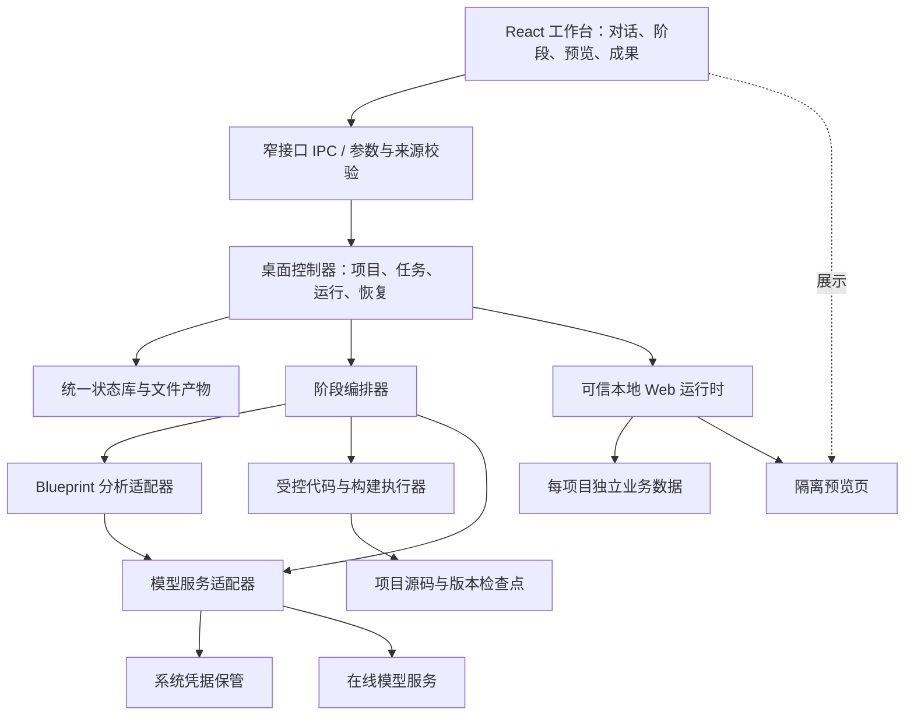

# 产品工厂技术设计建议

当前发布顺序按用户2026-10-05确认的D-037执行：先完成Mac和核心功能，Windows保留后续，Mac出口不再依赖Windows验收；历史双平台方案保留作为后续参考。

D-038在Workflow请求v2保存受限用户修改文字和原源码绑定，复用已有单写者/原子流程日志。Coding v2绑定原源码revision/hash，强制每次等待/工具前检查和读取既有文件后修改；模型仍只有三个源码工具。净差异按父流程精确前后检查点计算，历史只读，异常结果不冒认为无改动。原计划与用户业务证据不可由模型改写，真实数据与候选检查分离。

版本：0.2 · 更新日期：2026-10-05 · 文档状态：技术方案与分阶段实现边界

已开始开发，已有桌面版本。Electron/React/TypeScript、原子 JSON v1 项目清单与非流式 DeepSeek JSON 适配已实现，见 D-014/016/017 和 DEVELOPER_GUIDE。下列受管生成运行时、SQLite/Python worker 等仍为建议；S0 必须用证据验证后才能冻结。用户已确认的产品边界以 [PRD](PRD.md) 为准；任务实际进度只读取 [TASKS](TASKS.md)，本文件不承担进度记录。

0.2.0新增D-019固定博客实验：可信主进程HTTP服务、专用无特权预览会话、每项目原子JSON文章存储；不是任意生成后端或通用数据配置。已验证路径、会话来源、受测网络访问及生命周期，详见[S0-02证据](evidence/2026-10-02/S0-02/runtime-foundation/result.md)。完整生成执行边界仍按下文验证。

## 1. 目标与关键取舍

当前做成可安装的Mac本地工作台，Windows适配与发布按D-037延后。用户选择在线模型服务、填写 API Key 后，在同一界面完成需求澄清、方案和页面确认、代码生成、构建修复、预览与本地运行。首版生成 Web 应用，不提供公网发布、移动或桌面应用生成、离线模型。

推荐 Electron + React + TypeScript 作为工作台技术方向。理由是桌面界面、进程管理和前端技术栈可以统一；代价是安装体积、内存与分发维护成本。采用 Electron 不等于用户要安装 Node：应由安装包交付并管理运行能力。是否直接复用 Electron 的 Node 能力，还是另附专用 Node 运行时，必须在 S0 按构建工具兼容性、签名与子进程管理验证，不能假设系统 `PATH` 中已有 `node`、`python`、`git`。

按D-037先完成Mac核心功能、分发和干净环境验收；当前承诺的处理器架构、最低系统版本与硬件基线待S0冻结。一台开发机通过不能代表干净环境。Windows以后独立完成相应适配和验收，历史双平台设计保留供后续参考。

**本地运行方式已确认（D-015）**：项目由工作台一键启停，数据保存在本机；关闭工作台前明确告知受管应用将停止。完整源码导出属于首版，免环境独立启动包不进入首版。当前已有固定样例启停、受限生成前端预览、D-030项目级JSON持久数据、D-031源码导出、D-033数据备份恢复及D-034有限结构迁移。D-036/038串联自动开发与自然语言修改，完整应用业务验收和Mac正式分发仍待完成。

## 2. 两个项目如何整合

| 上游资产 | 首版整合方式 | 不应作出的推断 |
| --- | --- | --- |
| [agent-blueprint](https://github.com/hubooooooo/agent-blueprint) 的 Python 分析与检查能力 | 封装为可版本化的分析适配器，输入确认后的需求和项目摘要，输出架构建议、阶段结果、差距报告与用量信息 | 不能据此宣称已有完整编码执行、界面或一键安装能力 |
| [ai-product-starter-kit](https://github.com/hubooooooo/ai-product-starter-kit) 的文档、规则和开发手册 | 提炼为阶段定义、提问模板、产物格式、检查项和验收门槛 | 文档流程不是现成执行引擎；不能把提示词中的“完成”作为测试通过 |
| 新建的产品能力 | 桌面壳、统一状态、模型接入、编码工具、受控构建、预览、数据、恢复、安装包 | 需要实际实现并按D-037先完成Mac验证；Windows后续单独验证 |

已在 [上游审计](evidence/2026-10-02/S0-03/2026-10-02-upstream/result.md) 登记两个上游 SHA、MIT 许可、文件映射和直接依赖；当前只读参考副本不进入应用包。后续复用前仍需完整分发依赖清单。上游没有明确复用许可的部分先标记并确认处置，不直接复制进可分发产物。保持上游来源、改动和测试证据可追溯。

Blueprint 的原始设计对象是 Agent Harness，不能直接把所有 Web 应用都判定为需要 Agent 的工具、记忆和多智能体组件。整合层应先识别产品类型：普通博客使用 Web 需求、数据与页面规则；有 Agent 需求时再选择适用的 Blueprint 能力。不适用的组件明确记为不适用，不纳入缺失评分。分析规则、输出 schema 与提示词的适配需要用普通博客和 Agent 类案例对照验证，避免“复用”导致过度架构。

### Blueprint：保留 Python 还是迁移到 TypeScript

| 方案 | 收益 | 成本与风险 | 建议 |
| --- | --- | --- | --- |
| 打包 Python worker，通过 JSON Lines / stdio 调用 | 保留原有分析路径，便于与上游对照；用户无需安装 Python | 多一套运行时；依赖和资源打包、平台构建、进程取消、签名都要处理 | 作为 S0 优先验证方案 |
| 将逻辑迁移到 TypeScript | 统一运行时、类型和日志，长期维护较集中 | 可能丢失阶段续跑、解析或模型行为；属于重写，需要基准对照 | Python 分发验证不合格时评估，不预先承诺迁移 |
| 长期直接调用上游 CLI 并透传文本 | 原型接入快 | 字符串输出不稳定、状态分裂、错误难归类 | 仅允许用于 S0 试验，不作为最终接口 |

PyInstaller 官方说明可将解释器与依赖一起打包，用户不需要安装 Python；但产物绑定构建平台，不能从一份 Mac 包推定 Windows 可用。建议先验证目录模式，再决定安装包内部的组织方式。[PyInstaller 打包原理](https://www.pyinstaller.org/en/stable/operating-mode.html)

S0 比较同一组脱敏需求的结构化字段完整度、差距报告覆盖、失败恢复、启动时间和安装体积，记录实际结果。若 Python 方案通过，则先保留并建立适配协议；未来迁移时让新旧实现同时跑相同基准，完成对照后切换，不能仅因语言统一而重写。

## 3. 建议架构



| 模块 | 建议职责与边界 |
| --- | --- |
| 工作台 renderer | 展示与用户交互；不持有 API Key，不执行 Shell，不直接访问本机文件系统 |
| 主进程 / 控制器 | 窗口、生命周期、项目目录选择、受验证 IPC、凭据引用和运行控制；避免承担长计算 |
| 编排器 | 按持久状态推进阶段，保存输入、产物和确认版本，处理取消、重试和恢复 |
| Blueprint adapter | 屏蔽 Python 或 TS 实现差异，输出统一结果；worker 私有状态不能成为第二个产品真相源 |
| 模型适配器 | 供应商协议、流式输出、能力检测、限流和错误规范化；向其他组件返回凭据引用与用量，不暴露密钥 |
| 执行器 | 结构化读写文件、受控构建和检查；校验路径、参数、超时与目录范围 |
| 本地运行时 | 标准模板的可信服务、每项目存储、预览端口、AI 动作代理与健康检查 |
| 状态与证据层 | 保存项目、版本、阶段、任务、检查点、用量和实际验证证据 |

IPC 与 worker 协议建议包含 `schemaVersion / requestId / projectId / runId / type / payload`，事件增加单调递增 `sequence`。使用结构校验拒绝未知字段、跨项目引用和超限输入。日志只写入已脱敏信息，不能把任意日志字符串当可执行指令。

Python worker 若保留，应由适配器将模型请求交给统一模型服务，避免再保存另一份 Key、预算和供应商配置。若上游改造困难，S0 比较有限期凭据代理方案与迁移成本；不通过环境变量把整个宿主环境传给 worker。

## 4. 首版生成应用的技术边界

**下列范围是为了验证零配置运行而提出的技术建议，尚待 S0 与 PRD 一起冻结。** 首版不承诺任意技术栈、任意第三方库、任意自定义后端都能自动运行。

推荐先提供一套受支持模板：React + TypeScript 前端、统一设计组件和构建工具、可信本地服务、每项目 SQLite 数据。AI 可生成并持续修改页面和交互源码，执行构建、运行、检查与修复；同时生成受约束的数据模型、CRUD 和 AI 动作配置，服务端执行由经过测试的运行时负责。这是自动代码开发闭环的范围提案，不是用固定页面填空代替用户要求的编码能力。导出时包含这些配置、源码、运行契约与依赖锁定信息。

用户已选定首个真实案例为个人博客网站。建议基线包含文章增删改、草稿与发布状态、标签分类和本地图片，具体功能尚待逐项确认；“发布文章”仅指本地博客内可见，不是发布到公网。文章、图片和设置需要持久保存，重启或改样式不能丢失。个人任务看板、CSV 小型可视化、文本 AI 摘要作为补充验证场景，规模和参数在 S0 固定。支付、多人协作、高并发、复杂权限、任意外部插件、需要自行配置外部数据库的功能不进入建议基线。

为何要限制执行面：将 AI 生成的 Node 服务放进普通子进程，并不能防止其读取用户文件或向外发送数据。Node 官方明确说明其权限模型不是对恶意代码的安全保证；进程隔离、命令白名单和提示词约束不能被称为完整沙箱。[Node.js 权限模型](https://nodejs.org/api/permissions.html)

因此，S0 应优先验证“生成前端代码 + 声明式业务配置 + 可信后端运行时”的路线。若博客的确认需求无法由此覆盖，必须返回范围和方案讨论；不能静默降级为静态网站。若需执行任意生成后端，需要另行验证两平台操作系统级隔离或调整范围；不能默默转为宿主全权限执行，也不能默认要求小白安装 Docker、WSL 或开发工具。

## 5. 执行、预览与凭据边界

### 编码与构建

- AI 提交结构化 `readFile / writePatch / listFiles / build / validate / start / stop` 请求，不提交任意 Shell 字符串。工具层核验真实路径，处理 `..`、符号链接和 Windows 路径差异。
- 只改写当前项目允许目录；构建配置、工具二进制、依赖锁定和运行时文件由产品维护。默认不执行项目提供的安装脚本、构建插件、`postinstall` 或任意 npm script。
- 模板依赖与工具链随安装包或经过签名与校验的受管理资源交付；首版基础模板不能依赖用户手动安装工具。是否允许后台下载额外资源、下载失败后的恢复，在 S0 明确。
- 每次写入前创建检查点；候选变更先在临时工作副本构建和验证，通过后提交为新版本。失败不覆盖最后可运行版本。
- 构建错误可以触发有上限的自动修复。到达次数、时长或用量上限后暂停，提供原因、保留成果和可继续的动作，不能无限循环消耗费用。

### 页面与本地服务

- 生成页面使用独立会话与无特权 renderer，禁用 Node integration，开启 context isolation 和 sandbox；不给预览页挂工作台 preload 桥接。Electron 官方要求将不可信页面与高权限能力隔开，并验证 IPC 来源。[Electron 安全指导](https://www.electronjs.org/docs/latest/tutorial/security)
- 前端只连接当前项目的本地 API 与必要静态资源；为内容设置 CSP，限制新窗口、导航、权限请求及任意外网连接。用户界面不提供绕过开关。
- 本地服务默认绑定回环地址；随机端口、会话鉴权、Origin/Host 校验、请求大小与频率限制共同防止本机其他网页直接操作项目。不能把“只监听 localhost”当成充分隔离。
- 代码热更新不能自动删除业务数据；项目服务的停止、重启、异常退出和端口占用均由控制器管理。保存进程身份与运行标识，恢复时不能仅凭旧 PID 结束可能复用该 PID 的无关进程。
- 工作台一键启停是推荐默认。局域网开放、后台常驻、跨机器独立部署目前不作承诺。
- 候选变更预览与已构建的本地交付版本分别记录。交付版本关联不可变构建产物和源码版本，可在停止后再次启动；数据目录与构建产物分离。仅开发服务器或热更新预览启动成功，不满足本地部署验收。

### 模型凭据与生成应用中的 AI

- API Key 输入后交由凭据模块加密保管，项目、源码、日志、检查点和导出包只保存引用。若系统凭据服务不可用，不静默退回明文存储，提供会话内使用或修复指引。
- 可优先评估 Electron `safeStorage`。其 Mac 与 Windows 保护语义不同，Windows DPAPI 不能阻止同一登录用户权限下的其他应用，不能宣称绝对防泄漏。[Electron safeStorage](https://www.electronjs.org/docs/latest/api/safe-storage)
- 在线服务会接收需要分析的需求和代码片段；首次接入界面用简短说明呈现发送范围。模型请求不默认上传用户主目录、整个硬盘或不相关项目。
- 开发用模型调用和生成应用运行时的 AI 调用分别记账、分别设额度。生成应用通过限定用途的项目代理调用，不得到开发器 API Key，也不能借代理发起任意工具请求。
- 用户已选择 DeepSeek 及其他主流中国供应商的方向，DeepSeek 为首个必须验证的 provider。其他国内供应商名单、优先级与支持模型尚待建议和验证；不承诺任意供应商。建议从少量官方协议适配与经测试的兼容接口开始；不能把“OpenAI-compatible”视为所有模型都支持相同的工具调用、流式输出或结构化结果。
- 模型能力在连接测试时验证，结果随 provider/model/config 版本保存。重试区分鉴权、额度、限流、网络与格式错误；对于不确定是否已计费的请求，记录不确定性，不把取消等同于退款。

## 6. 状态、检查点与上下文恢复

产品运行状态与本项目开发台账是两层：以下为未来产品的数据设计；开发任务进度仍只写入 [TASKS](TASKS.md)。

建议用 SQLite 保存结构化产品状态，文档和源码保存为文件；数据库与文件之间通过事务日志、内容哈希和提交标记协调，避免只更新一侧。数据库选用方式、原生依赖 ABI、打包兼容性与备份机制均在 S0 验证。

| 对象 | 最小内容 |
| --- | --- |
| Project | ID、名称、路径、模板版本、当前可运行版本、最近活动 |
| RequirementRevision / Approval | 需求与界面方案版本、用户确认记录、被确认内容哈希 |
| Run / Stage / Task | 状态、输入版本、产物引用、重试与取消信息、必要执行环境版本 |
| Artifact / Checkpoint | 文件清单、内容哈希、检查结果、基础版本、恢复说明 |
| UsageRecord | provider/model、请求标识、供应商返回的 token 用量、价格配置版本与估算状态 |
| AppDataVersion | 业务数据库版本、迁移记录与备份引用 |

建议阶段状态为 `pending → running → awaiting_confirmation / succeeded / failed / cancelled`；中断重启时转入 `interrupted`，核对持久记录后再恢复。状态变更应能定位对应输入、产物和检查证据，模型自述不能直接置为 `succeeded`。

上下文压缩采用“项目约束 + 已确认需求与设计 + 当前任务 + 相关源码摘要 + 近期失败证据”的分层装配，完整原始记录仍保留在本地。记录摘要覆盖范围、原始引用和版本；不能拿过期摘要替代已修改的需求。模型新会话先读持久产物，不能仅依赖旧聊天历史。

用户改需求后，计算受影响阶段并使旧确认失效；已有源码和数据不删除。恢复操作应区分“恢复代码版本”和“恢复业务数据”：默认回退代码时不覆盖用户新数据；涉及不兼容数据迁移先备份并展示影响。

## 7. 自动开发循环与真实验证

建议流程：确认需求 → 确认页面和方案 → 分解任务 → 建立检查点 → 生成候选变更 → 类型/构建检查 → 启动健康检查 → 功能检查 → 更新预览与成果 → 下一任务或暂停。

每个循环保存输入版本、工具动作、关键输出和退出码。测试命令、验收脚本和可信检查器由产品维护，不能允许生成代码任意改写“通过”标准。检查范围与任务相称：页面文字变更以渲染核验为主，数据迁移与恢复必须做故障注入，执行边界必须做负向测试。

差距检查将“确认需求 → 实际文件/行为 → 检查证据”对应起来，输出已验证、未实现和证据不足三类结论。Blueprint 可辅助分析，但“模型认为符合”不能替代 CRUD 持久化、重启恢复或双平台安装的实测。

建议持久目录契约如下，实际路径在 S0/S1 固定：

```text
应用用户数据目录/
  state/                  工作台状态库与迁移记录
  credentials/            加密凭据材料；禁止加入导出
  runtimes/               受管理、带版本和校验的运行资源
  projects/<project-id>/
    project.json          无敏感信息的项目清单
    documents/            需求、设计、差距与版本
    source/               可导出的源码及业务配置
    data/                 业务数据库与上传图片，和源码版本分离
    checkpoints/          源码快照、迁移备份引用
    runs/                 运行记录、明确修改要求与脱敏技术证据
```

## 8. Mac交付与后续Windows适配

推荐安装包包含首版必需的运行资源与基础模板。发布构建应固定版本、依赖锁、工具校验与构建环境；当前按D-037完成Mac测试，Windows后续独立验证。原生模块、Python worker（若采用）、运行时与签名是同一交付链的一部分。

Mac 面向普通用户分发的路线需要验证签名和公证；正常安装体验不能以要求用户关闭系统保护为验收结果。Electron Forge 官方文档列出了签名、公证与开发者证书流程。[macOS 签名与公证](https://www.electronforge.io/guides/code-signing/code-signing-macos)

Windows按D-037延后；恢复推进时，安装程序、代码签名和实际系统提示也须在真实环境记录。签名不等于保证没有所有信誉或安全提示；凭据与费用届时在S0/S5对应Windows准备中落实，未经实际验收不能当作对非技术用户的最终交付。[Windows 签名](https://www.electronforge.io/guides/code-signing/code-signing-windows)

首版可以先采用手动安装新版本；自动更新是否纳入待 S0 冻结。无论更新方式如何，都需验证旧项目、凭据引用和业务数据迁移，保留回退路径。卸载不默认删除用户项目，清理行为应明确。

## 9. S0 必须关闭的技术疑点

1. 生成应用技术边界能否覆盖用户真实首例；若需任意后端，当前Mac执行隔离是否可行，后续Windows另验。
2. 当前Mac无需系统开发工具时，内置工具链、模板、持久数据和预览是否闭环；Windows按D-037延后验证。
3. Python worker 打包与协议改造是否值得保留；原始行为、续跑与用量如何对齐。
4. 首批供应商、模型能力、网络可达性、结构化输出与失败计费是否有实测依据。
5. 工作台托管启停与源码导出已由 D-015 确认；验证相应运行资源供应、启停和导出契约，不再把免环境独立包作为首版待选项。
6. 当前Mac支持矩阵、签名条件、性能和安装体积预算、基准用例参数；Windows恢复推进时单独冻结。

以上疑点通过后，在 [DECISIONS](DECISIONS.md) 写入决定、依据和放弃方案，再更新 PRD 与开发计划。官方文档只能证明方案存在，不等于本产品已实现或通过测试。

## 0.3.0 确定性计划适配器（D-020）

`blueprint-rules.ts`只移植固定SHA的组件选择及知识元数据。适配器不会运行Python、模型、扫描器或外部命令。Web类型输出17项不适用；Agent类型保留14项未知特征，不从普通文本推断已确认能力。完整MIT随内部包分发。此取舍只冻结局部纯规则实现，不替代上表的完整worker比较。

`createPlan`请求为schemaVersion、requestId、projectId、requirementId、designId和显式profile；拒绝未知字段、无效类型、未确认或过期版本。输入哈希绑定项目、两份版本内容哈希、profile和adapter/source版本。计划中的页面、功能、数据、验收任务直接引用需求列表索引，全部待实现/未运行；问题原样保留，页面名无法精确匹配仅提示核对，不当作模型判断。

项目清单仍是确认状态的唯一来源。派生记录保存在每项目`runs/development-plans.json`，schema 1、最多100次/16MiB，原子写入、fsync及路径/链接检查；读回按引用版本重新生成并校验输入/产物/事件，损坏时保留文件。相同requestId和输入返回原记录；同标识不同输入拒绝。新需求或页面版本使旧计划显示过期，历史不删除。进程内曾存在的文件被移走会拒绝继续；跨重启检测外部删掉的文件尚需独立索引/备份。

一次规则整理是同步纯计算，三条有序完成事件和结果一次提交，没有模型、文件执行或中间副作用；中断未提交时可重做。该协议尚无外部worker流式事件、取消/失败journal或编码恢复能力，这些仍属于S0-03/S3-03。`succeeded`仅指计划整理；任务与验收状态保持pending/not_run。

开发计划视图未展开audience、outOfScope及页面视觉细节。D-024的SourceToolExecutor.prepare已通过绑定版本提供完整确认内容，后续编码器消费该输入，不只消费tasks；派生记录不是另一份需求真相源。

## D-024源码工具协议实验

本轮先实现协调器绑定的虚拟源码树：list_files、read_file、apply_changes。项目/计划上下文由受信层传入，每调用重新核验最新需求和方案确认、当前计划ID及输入/产物哈希。模型仅指定src相对文件名，不能选择宿主根目录、密钥、业务数据、构建配置或任意Shell。源码内容保持文本，不执行也不物化。

source/workspace.json单文件记录原子源码版本与提交回执；修改携带expectedRevision、每文件expectedHash（新建为null）、requestId和确认计划绑定，批内有一项失败则不提交。40次提交、128个文件、单文件128KiB、源码树2MiB、记录16MiB为本轮可逆实现限额，非正式产品容量承诺。保留版本用于验证失败/中断与重开，不宣称完整检查点产品。未来受控构建需另行物化和执行隔离验证。

具体接口、错误处理与未验证边界见[SOURCE_TOOLS_PROTOCOL](SOURCE_TOOLS_PROTOCOL.md)，真实结果见[源码工具证据](evidence/2026-10-02/S0-03/source-tools/result.md)。S3-01结构化工具子项并行开始，不代表模型执行或整个S2出口通过。

## D-025模型源码草稿增量

受信CodingRunner连接ModelService.toolTurn与SourceToolExecutor，不向renderer开放任意工具分派。真实模型回合、持久预算、取消、每工具确认复查、工具事务映射及只读源码视图已接入；限制为4轮模型、12次工具、512KiB上下文。runs/coding.json保存运行元数据，source/workspace.json保存源码原子历史；中断显示不自动付费重放。细节与边界见[协议](SOURCE_TOOLS_PROTOCOL.md)，本轮结果见[报告](evidence/2026-10-03/S3-02/model-coding/result.md)。源码仍不物化、不构建、不执行；完整worker/差距产物协议尚缺。

## D-026受控构建增量

0.7.0通过固定工具链直接解析虚拟源码，不先物化到宿主src目录。BuildService在编译前后绑定确认计划和源码哈希，BuildStore只原子保存成功JS/CSS；失败保留旧产物。GeneratedPreview使用独立无特权session与限定静态协议，组合限制受测网络路径。随包二进制、运行时、取消/时间限制、容量和错误边界见[构建协议](CONTROLLED_BUILD.md)，实际检查见[报告](evidence/2026-10-03/S3-01/controlled-build/result.md)。编译是TS语法转换和打包，不等于完整类型检查或业务验收；生成前端暂不提供持久数据接口。

## 2026-10-03 D-027实施增量

0.8.0新增RepairRunner/RepairStore，先本地编译，失败时在4轮/12工具/5构建/180秒与总调用额度内反馈固定诊断，复用受限源码事务后真实重编译。修复元数据和固定诊断原子保存，终态不确定提交仅在同ID完整记录相等时认定，无法核实则停止；取消/进程重开不自动付费续跑。详见[有限修复协议](BOUNDED_REPAIR.md)及[TASKS](TASKS.md)。完整检查点与业务验收未完成。

### 2026-10-03 D-028源码检查点与中断核对

0.9.0在既有SourceStore原子历史上提供history/at/restore；恢复新建单调版本并原子升级schema 2，旧schema 1继续读取。元数据/目标哈希/完整历史逐步校验，不触碰data、确认或用量。BuildRunStore先持久意图、后编译，再存不可变产物及终态；重启核对实际副作用，不自动收费或执行工具。源码生成的保存不确定处理已与修复协调器统一。

RecoveryService核对全部源码、构建及生成/修复历史，界面展示最新各类运行和所有源码检查点。生成/修复/构建IPC在继续前执行完整性预检，缺失历史不能被当作空项目覆盖。已提交恢复回执允许在确认变化或归档后只读核对；没有回执仍须当前确认有效。详细[协议](CHECKPOINT_RECOVERY.md)包含容量、schema升级与尚未完成的业务迁移边界；本机[报告](evidence/2026-10-03/S3-03/checkpoint-recovery/result.md)不替代双平台或完整S3出口。

## 2026-10-04运行错误反馈落地补充

0.10.0在GeneratedPreview同一隔离工厂内增加隐藏候选观察和独立check；加载后1200毫秒观察、前后受信活性求值、12秒总截止，失败保留旧窗口。没有新增preload、Node或工作台桥接。仅固定类别事件、原子RuntimeReport与源码/计划/产物关联进入受信层，不持久化原始异常。

RuntimeService记录先于执行、支持取消/中断回执，优先当前版本最近活动，晚到可见错误不会被隐藏检查遮住。RepairRunner复用既有限额，每次编译成功后再检查启动，首次未复现不收费且不标修复成功；repairs首次运行修复升级schema 2，恢复协调器验证成功报告。范围与可信边界详见[协议](RUNTIME_FEEDBACK.md)，实际证据见[报告](evidence/2026-10-04/S3-02/runtime-feedback/result.md)。持久业务服务、交互回放与业务验收仍未完成。


## 0.11.0持久业务数据增量（D-030）

生成源码可导入固定`@factory/data` SDK，以read/apply操作项目级限额JSON。AppDataService按每次请求核验内部项目与确认计划；AppDataStore在data/generated保存原子快照、有限历史及去重回执，路径、其他项目、SQL或凭据不进入API。协议与容量见[持久数据说明](PERSISTENT_APP_DATA.md)。

预览/check/修复均使用独立空内存数据。用户显式打开本地应用时，先完成临时检查，再新建origin/session/window连接持久数据，候选不升级权限；新打开必须绑定当前源码。旧运行窗口可继续使用相同确认计划的数据，确认变化或归档后每次访问拒绝。窗口关闭撤销数据能力。持久窗口加载前已显示；加载中的已提交写入不因随后启动失败而回滚，保留旧窗口也不等于数据无副作用。

实际React表单证明原CSP sandbox阻止正常submit事件；补allow-forms后保留form-action none、无allow-same-origin及导航/网络拒绝。当前Mac真实表单可保存且外部原生提交无流量。运行报告新增application模式并在首次写入时升schema 2，应使用0.11.0或更新版。源码恢复仅改源码，业务JSON字节保留；数据迁移与业务备份恢复UI尚未实现。[实际证据](evidence/2026-10-04/S4-01/persistent-app/result.md)。

## 0.12.0源码维护包导出增量（D-031）

ExportService捕获当前确认文档与源码，并记录源码实际提交绑定；通过主进程原生对话框选择ZIP新文件，返回后再核对版本指纹。工作台变更门闩和服务互斥阻止重复导出；只允许明确载荷，不读取业务数据。ModelService在可信边界内检查当前Key及有限凭据模式，命中不回显、不改源码。工具包需具备15个固定文件并通过大小/哈希核验；源码/文档中的私人文字仍是导出内容，扫描不是完整脱敏保证。

ExportArchive生成标准UTF-8 ZIP32，约束条目路径、容量与普通文件类型；独占临时文件写入、fsync并核对目录/文件身份后不可覆盖发布。保护当前数据及程序目录，打包版Mac保护整个.app。丢失确认时只在文件身份与内容一致时确认成功，否则保留结果供核对。目录限制不等于抵御同用户任意文件系统篡改。

随包构建工具从已锁定依赖生成，导出带真实npm锁、MIT许可及独立完整性脚本。重建使用同一受控虚拟编译器，不执行生成配置/后端；仅输出app.js/app.css/runtime.js/data.js，依赖原数据协议宿主，无独立服务器或自动导入。首版范围与限制见[协议](SOURCE_EXPORT.md)，测试/包证据见[报告](evidence/2026-10-04/S4-03/source-export/result.md)。

## 0.13.0预算与项目文本AI增量（D-032）

ModelService把开发请求与应用请求的记账策略分开，保持统一连接和全局单请求约束。provider.json升级schema 2，持久预留调用与预算占用，返回有效usage后结算；旧未知用量不按零启用token限额。累计溢出饱和为不可继续消费的预算占用，不自动清零或退款。

AppAiStore在每个项目runs下原子保存授权和有界去重账本，初始化标记识别账本丢失。AppAiService绑定确认计划、连接版本及窗口会话；只在持久应用开启固定文本代理，关窗/撤销/归档/确认失效取消所属请求，晚到输出被丢弃。SDK通过隔离origin的/app-ai路由，主框架、一次性请求许可、容量/并发/来源及CSP共同约束；生成页面无Key和任意URL参数。正文不写用量账本，授权后的应用代码能够主动发起调用，并非每次调用由宿主验证用户手势。

导出工具增加ai.js，合计16文件，编译产物含五个固定前端文件；授权/账本/凭据不导出。实现限额、预留偏差、故障行为和剩余边界见[协议](APPLICATION_AI.md)，实际验证见[报告](evidence/2026-10-04/S4-03/ai-budget/result.md)。不包含价格配置、主动数据导出、独立AI服务器或完整业务验收。

## 0.14.0数据备份与显式恢复增量（D-033）

DataBackupService仅接受工作台可信IPC：状态只返回版本/数量，原生chooser选备份位置，renderer不能提交宿主路径或完整待恢复数据。独立JSON封装版本、project/storeId、源码文件树内容哈希和当前规范业务快照，不包含源码/历史/AI账本/凭据/固定样例数据。导出复用独占临时写入与不可覆盖发布，可信固定data-backup-json格式单独限制扩展和大小；原源码ZIP规则保留。

导入读取器检查祖先与文件身份、普通文件/单硬链接、字节上限和两遍稳定读取，协议严格校验UTF-8/字段/JSON容量/完整性。确认前只有主进程保存10分钟预览令牌及已解析内容，UI获得增删改键摘要。项目/storeId或源码内容不匹配拒绝；同源码内容的不同修订号可恢复，这不是业务结构兼容性证明。

AppDataStore.inspect不初始化或自动补标记；restore只针对已有完整有效存储，整体替换最多128键，保存为current+1，保留5份历史与256回执。确认先检查快照，再关闭所属持久应用并等待撤销完成，重新检查后单次原子提交；恢复回执按独立operation域哈希，重试沿同token/请求核对，不回退旧回执或AI用量。预览后的业务写入、源码/项目变化、取消均不能被盲目覆盖。没有损坏库重建、跨机器迁移或自动重开应用。详见[协议](DATA_BACKUP.md)。

### D-034业务JSON结构版本

0.15.0以src/data-schema.json的有限声明绑定生成应用的数据访问；结构定义哈希与完整源码快照分别校验。schema2存储将结构/值/最近迁移前检查点与既有回执在同一原子记录提交，相邻迁移和无后续写入的受限回退均追加revision。四个工作台IPC只处理状态/预览/确认/丢弃，生成SDK不增加迁移或任意执行能力；临时会话仍不接触持久库。备份v2携带结构，v1按未声明结构兼容，不能通过恢复改变结构。细节、上限和旧版本边界见[迁移协议](DATA_MIGRATION.md)。

### D-035差距报告的证据边界

0.16.0在不可变PlanRun之外派生GapReport，读取SourceStore快照及实际提交绑定、BuildService/RuntimeService的当前证据。可选src/requirements.json只提供taskId到路径的模型声明；严格解析、无脚本执行、无覆盖率评分。GapEvidenceStore独立保存用户观察，GapService在单写者内核对当前计划/源码/构建，旧记录只标过期。模型和生成窗口均无写入用户证据的通道，不读取业务数据或自动调用模型。协议、容量和未实现项见[GAP_REPORT](GAP_REPORT.md)。

### D-036自动开发协调

0.17.0以WorkflowRunner组合既有生成/编译/运行/修复服务，WorkflowStore独立保存有界父流程元数据；每个阶段先持久意图，再精确关联子请求与真实产物。主IPC仍单写者，取消锁住父任务后传递给子任务，整个流程有5分钟上限。只读按ID核对与新执行分离；重开中断不自动续跑。当前ready重新核验真实构建与启动报告，过期候选不代表当前源码。来源检查、限额、故障行为和未实现项见[协议](AUTOMATIC_WORKFLOW.md)。

### D-039修改后修复上下文

0.19.0修复0.18.0修改流程后续修复仅收到原计划与错误诊断、缺少本次用户要求的问题。共享`workflowRepairRequest`按父repair阶段的`repairRequestVersion: 2`构造内部修复v2，把父workflowId、修改前sourceRevision/sourceHash和规范化instruction作为`modification`传入；当前待修源码revision和可选runtimeReportId继续独立绑定。编译修复与启动修复都收到这份上下文，先核对原源码检查点和当前计划、扫描敏感输入，再保存子意图。模型提示要求保留本次修改，不把要求本身当作扩权依据，也不能自行认定业务通过。

父流程完成修复及历史读取均重建规范子请求并核对requestHash、计划和前后源码/产物身份。旧0.18.0 modify记录的未标记repair仍保持v1字段顺序及原哈希，不补写历史标记。工作台`repairSource`仅接受独立v1；内部v2不成为renderer可伪造的上下文入口。要求正文仍只在workflows父台账保存，repairs子台账不新增正文、完整提示或供应商消息。

首次保存修改请求时，旧workflows文件先升为schema 2；首次保存新修复阶段标记时再原子升级为3，后续不降级。新程序兼容旧schema 1/2，旧格式不能容纳新标记，未知未来格式保留原文件并拒绝。初始化标记仍为schema 1/storeId不变，原50条/2 MiB限额、源码事务与取消边界不变。整个流程仍最多300秒、8轮模型、24工具、6构建，其中有限修复至多一次、4轮/12工具/5构建/180秒；本补充不扩大费用预算或工具权限。详见[修改协议](APPLICATION_MODIFICATION.md)。
